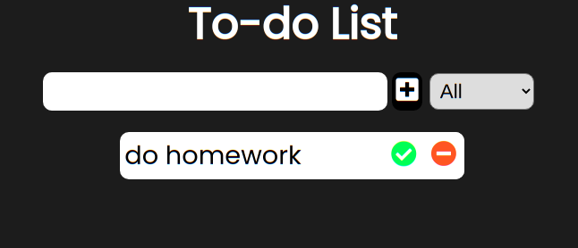
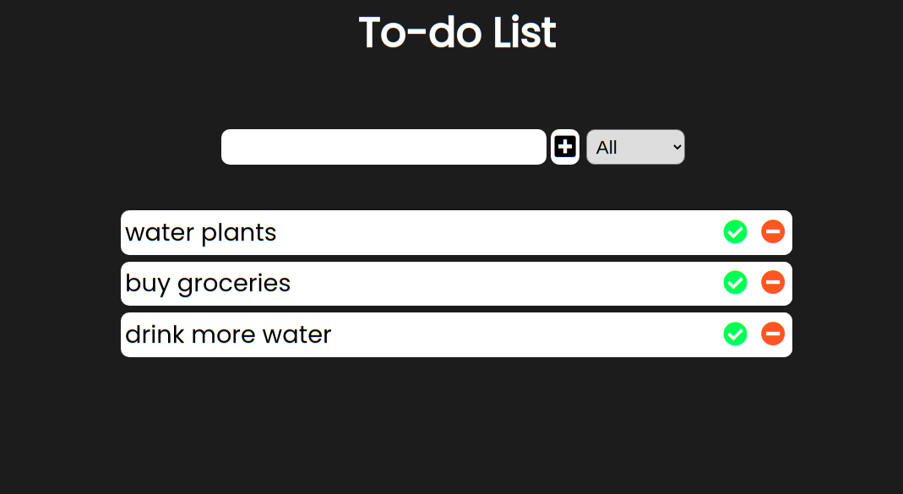
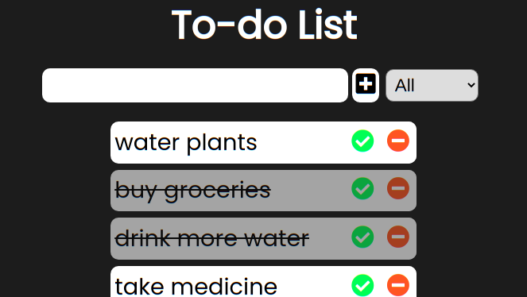

# Simple Todo

> A simple to-do app to track your things.

---

## Table of Contents
- [Description](#description)
- [Technologies](#technologies)
- [How To Use](#how-to-use)
- [License](#license)

---

## Description
- A simple to-do app that helps you keep a track of things. Made with vanilla JavaScript.
- Responsive design.
- Stores todo between sessions.
- Todos not lost even after refresh.
- Differentiate todos based on status.
- Track your life better.

---

## Technologies
- JavaScript
- HTML
- CSS

---

## How To Use
Use this link to view the hosted project on github pages [here](https://vshalt.github.io/simple-todo) or https://vshalt.github.io/simple-todo

---

## License
MIT License.
[Read here](./LICENSE)

---

[back to top](#simple-todo)

